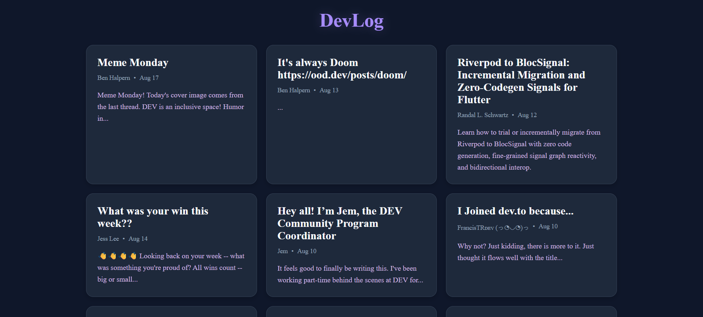
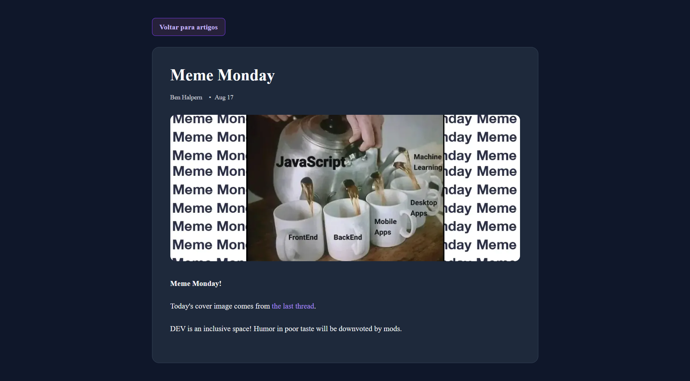

# 📝 DevLog

Blog desenvolvido com **Next.js, React e TypeScript**,utilizando o **App Router, Server Components e rotas dinâmicas**.

🔗 [Acesse o projeto online](https://blog-artigos-lac.vercel.app/)

## 📸 Preview





## Funcionalidades

* Listagem de artigos
* Página individual para cada artigo
* Rotas dinâmicas utilizando `slug`
* Utilização de Server Components
* Interface responsiva
* Organização por componentes
* Integração com a API di Dev.to
* Deploy realizado na Vercel

## 📂 Estrutura do projeto

```text
src/
├── app/
│   ├── artigos/
│   │   └── [slug]/
│   │       ├── page.tsx
│   │       └── page.module.css
│   │
│   ├── globals.css
│   ├── layout.tsx
│   ├── not-found.tsx
│   ├── page.module.css
│   └── page.tsx
│
├── lib/
│   └── artigos.ts
│
└── types/
    ├── artigo.ts
    └── devto.ts
```

## Como executar o projeto

### 1. Clone o repositório

```bash
git clone https://github.com/IsabelleLandini/blog-artigos.git
```

### 2. Entre na pasta

```bash
cd blog-artigos
```

### 3. Instale as dependências

```bash
npm install
```

### 4. Execute o projeto em desenvolvimento

```bash
npm run dev
```

### 5. Acesse no navegador

```text
http://localhost:3000
```

---

## 👩🏻‍💻 Desenvolvido por

**Isabelle Landini**

Projeto desenvolvido para prática de desenvolvimento Front-End com **Next.js e TypeScript**.
